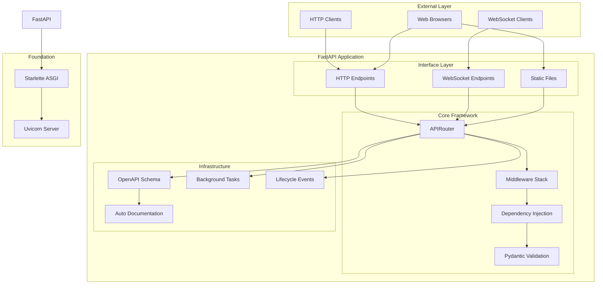
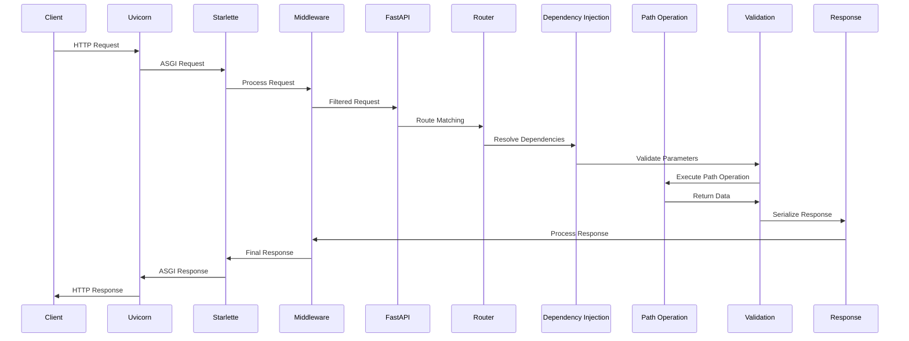
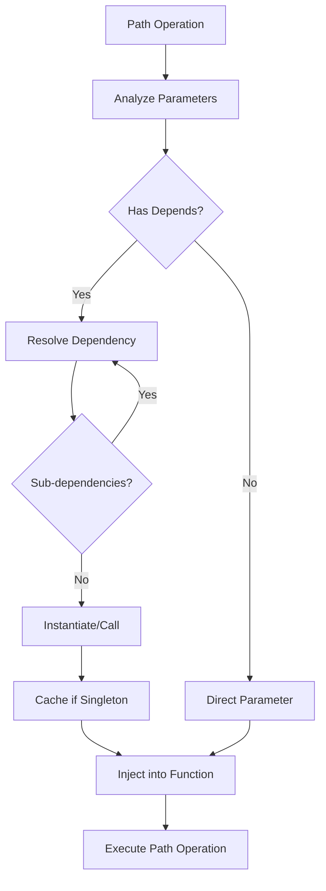
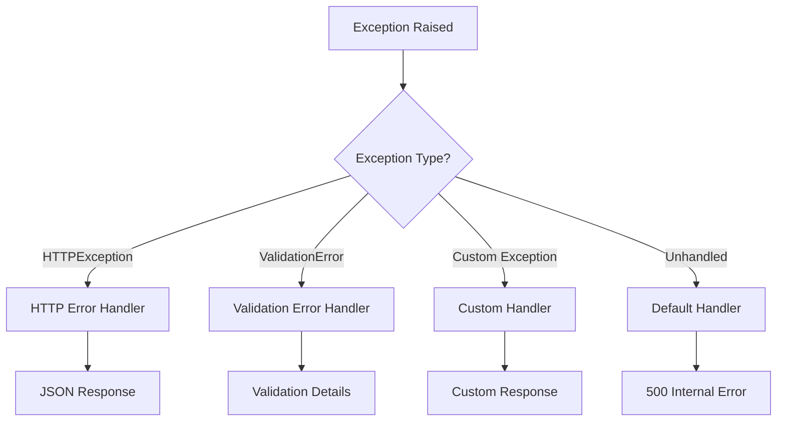
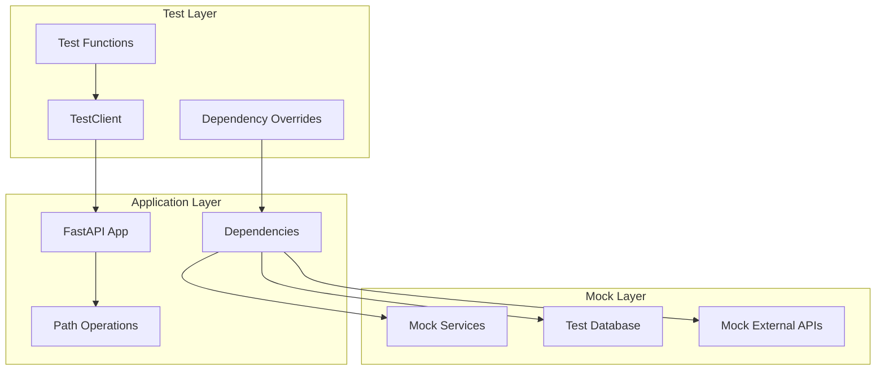

# Architecture Documentation

_Generated: 2026-03-19T08:03:42+00:00_

## Run-Full Summary

- **Repo files:** 2661
- **Predicted generator tokens:** 149885
- **Effective limit:** 182000 (max=198000, margin=16000)
- **Attempts used:** 2
- **User prompt:** ON

---

## Planner Summary

- **Inbound interfaces:** N/A
- **Selected files (200):**
 - `.github/DISCUSSION_TEMPLATE/questions.yml`
 - `.github/DISCUSSION_TEMPLATE/translations.yml`
 - `.github/FUNDING.yml`
 - `.github/ISSUE_TEMPLATE/config.yml`
 - `.github/ISSUE_TEMPLATE/privileged.yml`
 - `.github/dependabot.yml`
 - `.github/labeler.yml`
 - `.github/workflows/add-to-project.yml`
 - `.github/workflows/build-docs.yml`
 - `.github/workflows/contributors.yml`
 - `.github/workflows/deploy-docs.yml`
 - `.github/workflows/detect-conflicts.yml`
 - `.github/workflows/issue-manager.yml`
 - `.github/workflows/label-approved.yml`
 - `.github/workflows/labeler.yml`
 - `.github/workflows/latest-changes.yml`
 - `.github/workflows/notify-translations.yml`
 - `.github/workflows/people.yml`
 - `.github/workflows/pre-commit.yml`
 - `.github/workflows/publish.yml`
 - `.github/workflows/smokeshow.yml`
 - `.github/workflows/sponsors.yml`
 - `.github/workflows/test-redistribute.yml`
 - `.github/workflows/test.yml`
 - `.github/workflows/topic-repos.yml`
 - `.github/workflows/translate.yml`
 - `CONTRIBUTING.md`
 - `README.md`
 - `SECURITY.md`
 - `docs/de/docs/_llm-test.md`
 - `docs/de/docs/about/index.md`
 - `docs/de/docs/advanced/additional-responses.md`
 - `docs/de/docs/advanced/additional-status-codes.md`
 - `docs/de/docs/advanced/advanced-dependencies.md`
 - `docs/de/docs/advanced/advanced-python-types.md`
 - `docs/de/docs/advanced/async-tests.md`
 - `docs/de/docs/advanced/behind-a-proxy.md`
 - `docs/de/docs/advanced/custom-response.md`
 - `docs/de/docs/advanced/dataclasses.md`
 - `docs/de/docs/advanced/events.md`
 - `docs/de/docs/advanced/generate-clients.md`
 - `docs/de/docs/advanced/index.md`
 - `docs/de/docs/advanced/middleware.md`
 - `docs/de/docs/advanced/openapi-callbacks.md`
 - `docs/de/docs/advanced/openapi-webhooks.md`
 - `docs/de/docs/advanced/path-operation-advanced-configuration.md`
 - `docs/de/docs/advanced/response-change-status-code.md`
 - `docs/de/docs/advanced/response-cookies.md`
 - `docs/de/docs/advanced/response-directly.md`
 - `docs/de/docs/advanced/response-headers.md`
 - `docs/de/docs/advanced/security/http-basic-auth.md`
 - `docs/de/docs/advanced/security/index.md`
 - `docs/de/docs/advanced/security/oauth2-scopes.md`
 - `docs/de/docs/advanced/settings.md`
 - `docs/de/docs/advanced/sub-applications.md`
 - `docs/de/docs/advanced/templates.md`
 - `docs/de/docs/advanced/testing-dependencies.md`
 - `docs/de/docs/advanced/testing-events.md`
 - `docs/de/docs/advanced/testing-websockets.md`
 - `docs/de/docs/advanced/using-request-directly.md`
 - `docs/de/docs/advanced/websockets.md`
 - `docs/de/docs/advanced/wsgi.md`
 - `docs/de/docs/alternatives.md`
 - `docs/de/docs/async.md`
 - `docs/de/docs/benchmarks.md`
 - `docs/de/docs/deployment/cloud.md`
 - `docs/de/docs/deployment/concepts.md`
 - `docs/de/docs/deployment/docker.md`
 - `docs/de/docs/deployment/fastapicloud.md`
 - `docs/de/docs/deployment/https.md`
 - `docs/de/docs/deployment/index.md`
 - `docs/de/docs/deployment/manually.md`
 - `docs/de/docs/deployment/server-workers.md`
 - `docs/de/docs/deployment/versions.md`
 - `docs/de/docs/environment-variables.md`
 - `docs/de/docs/fastapi-cli.md`
 - `docs/de/docs/features.md`
 - `docs/de/docs/help-fastapi.md`
 - `docs/de/docs/history-design-future.md`
 - `docs/de/docs/how-to/authentication-error-status-code.md`
 - `docs/de/docs/how-to/conditional-openapi.md`
 - `docs/de/docs/how-to/configure-swagger-ui.md`
 - `docs/de/docs/how-to/custom-docs-ui-assets.md`
 - `docs/de/docs/how-to/custom-request-and-route.md`
 - `docs/de/docs/how-to/extending-openapi.md`
 - `docs/de/docs/how-to/general.md`
 - `docs/de/docs/how-to/graphql.md`
 - `docs/de/docs/how-to/index.md`
 - `docs/de/docs/how-to/migrate-from-pydantic-v1-to-pydantic-v2.md`
 - `docs/de/docs/how-to/separate-openapi-schemas.md`
 - `docs/de/docs/how-to/testing-database.md`
 - `docs/de/docs/index.md`
 - `docs/de/docs/learn/index.md`
 - `docs/de/docs/project-generation.md`
 - `docs/de/docs/python-types.md`
 - `docs/de/docs/resources/index.md`
 - `docs/de/docs/translation-banner.md`
 - `docs/de/docs/tutorial/background-tasks.md`
 - `docs/de/docs/tutorial/bigger-applications.md`
 - `docs/de/docs/tutorial/body-fields.md`
 - `docs/de/docs/tutorial/body-multiple-params.md`
 - `docs/de/docs/tutorial/body-nested-models.md`
 - `docs/de/docs/tutorial/body-updates.md`
 - `docs/de/docs/tutorial/body.md`
 - `docs/de/docs/tutorial/cookie-param-models.md`
 - `docs/de/docs/tutorial/cookie-params.md`
 - `docs/de/docs/tutorial/cors.md`
 - `docs/de/docs/tutorial/debugging.md`
 - `docs/de/docs/tutorial/dependencies/classes-as-dependencies.md`
 - `docs/de/docs/tutorial/dependencies/dependencies-in-path-operation-decorators.md`
 - `docs/de/docs/tutorial/dependencies/dependencies-with-yield.md`
 - `docs/de/docs/tutorial/dependencies/global-dependencies.md`
 - `docs/de/docs/tutorial/dependencies/index.md`
 - `docs/de/docs/tutorial/dependencies/sub-dependencies.md`
 - `docs/de/docs/tutorial/encoder.md`
 - `docs/de/docs/tutorial/extra-data-types.md`
 - `docs/de/docs/tutorial/extra-models.md`
 - `docs/de/docs/tutorial/first-steps.md`
 - `docs/de/docs/tutorial/handling-errors.md`
 - `docs/de/docs/tutorial/header-param-models.md`
 - `docs/de/docs/tutorial/header-params.md`
 - `docs/de/docs/tutorial/index.md`
 - `docs/de/docs/tutorial/metadata.md`
 - `docs/de/docs/tutorial/middleware.md`
 - `docs/de/docs/tutorial/path-operation-configuration.md`
 - `docs/de/docs/tutorial/path-params-numeric-validations.md`
 - `docs/de/docs/tutorial/path-params.md`
 - `docs/de/docs/tutorial/query-param-models.md`
 - `docs/de/docs/tutorial/query-params-str-validations.md`
 - `docs/de/docs/tutorial/query-params.md`
 - `docs/de/docs/tutorial/request-files.md`
 - `docs/de/docs/tutorial/request-form-models.md`
 - `docs/de/docs/tutorial/request-forms-and-files.md`
 - `docs/de/docs/tutorial/request-forms.md`
 - `docs/de/docs/tutorial/response-model.md`
 - `docs/de/docs/tutorial/response-status-code.md`
 - `docs/de/docs/tutorial/schema-extra-example.md`
 - `docs/de/docs/tutorial/security/first-steps.md`
 - `docs/de/docs/tutorial/security/get-current-user.md`
 - `docs/de/docs/tutorial/security/index.md`
 - `docs/de/docs/tutorial/security/oauth2-jwt.md`
 - `docs/de/docs/tutorial/security/simple-oauth2.md`
 - `docs/de/docs/tutorial/sql-databases.md`
 - `docs/de/docs/tutorial/static-files.md`
 - `docs/de/docs/tutorial/testing.md`
 - `docs/de/docs/virtual-environments.md`
 - `docs/de/llm-prompt.md`
 - `docs/de/mkdocs.yml`
 - `docs/en/data/contributors.yml`
 - `docs/en/data/github_sponsors.yml`
 - `docs/en/data/members.yml`
 - `docs/en/data/people.yml`
 - `docs/en/data/skip_users.yml`
 - `docs/en/data/sponsors.yml`
 - `docs/en/data/sponsors_badge.yml`
 - `docs/en/data/topic_repos.yml`
 - `docs/en/data/translation_reviewers.yml`
 - `docs/en/data/translators.yml`
 - `docs/en/docs/_llm-test.md`
 - `docs/en/docs/about/index.md`
 - `docs/en/docs/advanced/additional-responses.md`
 - `docs/en/docs/advanced/additional-status-codes.md`
 - `docs/en/docs/advanced/advanced-dependencies.md`
 - `docs/en/docs/advanced/advanced-python-types.md`
 - `docs/en/docs/advanced/async-tests.md`
 - `docs/en/docs/advanced/behind-a-proxy.md`
 - `docs/en/docs/advanced/custom-response.md`
 - `docs/en/docs/advanced/dataclasses.md`
 - `docs/en/docs/advanced/events.md`
 - `docs/en/docs/advanced/generate-clients.md`
 - `docs/en/docs/advanced/index.md`
 - `docs/en/docs/advanced/json-base64-bytes.md`
 - `docs/en/docs/advanced/middleware.md`
 - `docs/en/docs/advanced/openapi-callbacks.md`
 - `docs/en/docs/advanced/openapi-webhooks.md`
 - `docs/en/docs/advanced/path-operation-advanced-configuration.md`
 - `docs/en/docs/advanced/response-change-status-code.md`
 - `docs/en/docs/advanced/response-cookies.md`
 - `docs/en/docs/advanced/response-directly.md`
 - `docs/en/docs/advanced/response-headers.md`
 - `docs/en/docs/advanced/security/http-basic-auth.md`
 - `docs/en/docs/advanced/security/index.md`
 - `docs/en/docs/advanced/security/oauth2-scopes.md`
 - `docs/en/docs/advanced/settings.md`
 - `docs/en/docs/advanced/stream-data.md`
 - `docs/en/docs/advanced/strict-content-type.md`
 - `docs/en/docs/advanced/sub-applications.md`
 - `docs/en/docs/advanced/templates.md`
 - `docs/en/docs/advanced/testing-dependencies.md`
 - `docs/en/docs/advanced/testing-events.md`
 - `docs/en/docs/advanced/testing-websockets.md`
 - `docs/en/docs/advanced/using-request-directly.md`
 - `docs/en/docs/advanced/websockets.md`
 - `docs/en/docs/advanced/wsgi.md`
 - `docs/en/docs/alternatives.md`
 - `docs/en/docs/async.md`
 - `docs/en/docs/benchmarks.md`
 - `docs/en/docs/contributing.md`
 - `docs/en/docs/deployment/cloud.md`
 - `docs/en/docs/deployment/concepts.md`

- **Evidence priority:**
 - `README.md`
 - `CONTRIBUTING.md`
 - `SECURITY.md`
 - `.github/workflows/test.yml`
 - `.github/workflows/publish.yml`
 - `.github/workflows/build-docs.yml`
 - `.github/workflows/deploy-docs.yml`
 - `docs/en/docs/index.md`
 - `docs/en/docs/tutorial/first-steps.md`
 - `docs/en/docs/tutorial/index.md`
 - `docs/en/docs/deployment/index.md`
 - `docs/en/docs/advanced/index.md`

### Planner Notes

Selected all available files since this is a full scan request with no specific entry files. Prioritized core documentation files like README, contributing guidelines, security policy, and key GitHub workflows that reveal the project's CI/CD architecture. The project appears to be FastAPI documentation with extensive multilingual content and automated workflows for testing, publishing, and documentation deployment.

---

---

## Generated Documentation

# FastAPI Framework Architecture Documentation

## System Overview and Purpose

FastAPI is a modern, high-performance web framework for building APIs with Python 3.7+ based on standard Python type hints. The framework is designed to be fast, easy to use, and production-ready, providing automatic API documentation generation, data validation, and serialization.

### Key Technologies and Frameworks

| Technology | Purpose | Integration |
|------------|---------|-------------|
| **Starlette** | ASGI framework foundation | Core web server capabilities |
| **Pydantic** | Data validation and serialization | Request/response model validation |
| **Uvicorn** | ASGI server | Production deployment |
| **OpenAPI/Swagger** | API documentation | Automatic schema generation |
| **Jinja2** | Template engine | HTML response rendering |
| **SQLModel** | Database ORM | SQL database integration |

## Architecture Diagram

## Major Components and Responsibilities

| Component | Purpose | Key Files | Responsibilities |
|-----------|---------|-----------|------------------|
| **FastAPI Application** | Main application class | `fastapi/applications.py` | Application lifecycle, routing configuration, middleware setup |
| **APIRouter** | Route organization | `fastapi/routing.py` | Path operation registration, route grouping, dependency management |
| **Dependency Injection** | Service composition | `fastapi/dependencies/` | Parameter resolution, service instantiation, lifecycle management |
| **Middleware Stack** | Request/response processing | `fastapi/middleware/` | CORS, HTTPS redirect, trusted host, gzip compression |
| **Security System** | Authentication/authorization | `fastapi/security/` | OAuth2, HTTP Basic, API keys, JWT tokens |
| **Validation Engine** | Data validation | Pydantic integration | Request/response model validation, type conversion |
| **OpenAPI Generator** | API documentation | `fastapi/openapi/` | Schema generation, documentation UI, client generation |
| **Background Tasks** | Async task execution | `fastapi/background.py` | Post-response task scheduling |
| **Testing Framework** | Test utilities | `fastapi/testclient.py` | HTTP/WebSocket testing, dependency overrides |

## Request Lifecycle from HTTP to Response

## Dependency Injection System Design

| Component | Responsibility | Implementation |
|-----------|----------------|----------------|
| **Depends()** | Dependency declaration | Function/class dependency marker |
| **Dependency Resolver** | Parameter injection | Automatic resolution of function parameters |
| **Scope Management** | Lifecycle control | Request-scoped, singleton, and custom scopes |
| **Sub-dependencies** | Nested dependencies | Hierarchical dependency resolution |
| **Dependency Overrides** | Testing support | Runtime dependency replacement |
| **Callable Classes** | Stateful dependencies | Class-based dependency providers |

### Dependency Resolution Flow

## Middleware and Plugin Architecture

| Middleware Type | Purpose | Configuration |
|----------------|---------|---------------|
| **CORS Middleware** | Cross-origin requests | Origins, methods, headers configuration |
| **HTTPS Redirect** | Force HTTPS | Automatic HTTP to HTTPS redirection |
| **Trusted Host** | Host validation | Allowed hosts whitelist |
| **GZip Compression** | Response compression | Minimum size threshold |
| **Custom Middleware** | Application-specific logic | Request/response processing hooks |

### Middleware Stack Processing

## Error Handling Patterns

| Error Type | Handler | Response Format |
|------------|---------|-----------------|
| **HTTP Exceptions** | `HTTPException` | JSON with status code and detail |
| **Validation Errors** | `RequestValidationError` | JSON with field-level error details |
| **Custom Exceptions** | `@app.exception_handler` | User-defined response format |
| **Starlette Exceptions** | Built-in handlers | Framework-level error responses |
| **Dependency Errors** | Automatic propagation | Bubbled up through dependency chain |

### Error Handling Flow

## Testing Architecture

| Testing Component | Purpose | Implementation |
|-------------------|---------|----------------|
| **TestClient** | HTTP testing | Starlette TestClient wrapper |
| **WebSocket Testing** | WebSocket testing | Connection simulation and message testing |
| **Dependency Overrides** | Test isolation | Runtime dependency replacement |
| **Event Testing** | Lifecycle testing | Startup/shutdown event validation |
| **Database Testing** | Data layer testing | Test database setup and teardown |
| **Async Testing** | Async operation testing | AsyncIO test support |

### Test Structure

## Key Design Decisions and Trade-offs

| Decision | Rationale | Trade-offs |
|----------|-----------|------------|
| **Type Hints First** | Leverage Python 3.7+ type system | Better IDE support vs. Python 3.6 compatibility |
| **Starlette Foundation** | Proven ASGI framework | Performance vs. framework size |
| **Pydantic Integration** | Automatic validation/serialization | Validation overhead vs. developer productivity |
| **Automatic Documentation** | OpenAPI schema generation | Schema accuracy vs. customization flexibility |
| **Dependency Injection** | Testability and modularity | Learning curve vs. code organization |
| **Async-First Design** | High concurrency support | Complexity vs. performance |

### Performance Characteristics

| Aspect | Design Choice | Impact |
|--------|---------------|--------|
| **Request Processing** | ASGI-based async | High concurrency, low memory usage |
| **Validation** | Pydantic models | Fast C-based validation with Python fallback |
| **Serialization** | JSON optimization | Multiple JSON libraries support (orjson, ujson) |
| **Documentation** | Runtime schema generation | Minimal startup overhead, dynamic updates |
| **Dependency Resolution** | Cached resolution | Fast parameter injection, memory efficient |

### Extensibility Points

| Extension Point | Mechanism | Use Cases |
|----------------|-----------|-----------|
| **Custom Responses** | Response class inheritance | Custom serialization formats |
| **Middleware** | ASGI middleware pattern | Cross-cutting concerns |
| **Exception Handlers** | Decorator-based registration | Custom error responses |
| **OpenAPI Customization** | Schema modification hooks | API documentation customization |
| **Dependency Providers** | Callable classes/functions | Service integration |
| **Route Classes** | APIRoute inheritance | Custom request/response processing |

## Gaps & Uncertainties

- **Database Integration**: Evidence shows SQLModel examples but no core database abstraction layer
- **Message Queue Support**: No built-in message queue or event streaming capabilities detected
- **Service Discovery**: No evidence of built-in service discovery or load balancing features
- **Caching Layer**: No framework-level caching abstraction identified
- **Monitoring/Observability**: Limited evidence of built-in metrics or tracing capabilities

---

## Token Usage

### Planner

| Metric | Tokens |
|---|---:|
| Prompt | 4141 |
| Completion | 3551 |
| Total | 7692 |

### Generator (Streaming)

| Metric | Tokens |
|---|---:|
| Prompt | 190628 |
| Completion | 2728 |
| Total | 193356 |

### Streaming Stats

| Metric | Value |
|---|---:|
| Delta chars | 10714 |
| SSE lines | None |
| Chunks total | 828 |
| Chunks w/ delta | None |
