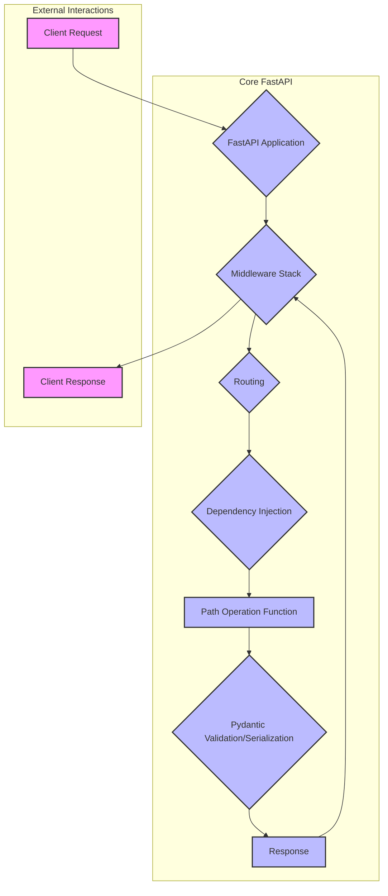

# Architecture Documentation

_Generated: 2026-03-19T07:52:13+00:00_

# Codebase Gist

## What Is This?
This repository contains the source code and extensive documentation for FastAPI, a modern, fast (high-performance) web framework for building APIs with Python 3.8+ based on standard Python type hints. It's designed for developers who need to build robust and scalable web services quickly, leveraging automatic interactive API documentation (Swagger UI and ReDoc) and data validation provided by Pydantic. The project serves as both the framework's core and its comprehensive learning resource, making it a modular monolith in its structure, with the core framework components and a vast array of examples and tutorials.

## Tech Stack
- **Languages**: Python (primary), YAML, JavaScript
- **Framework**: FastAPI (built on Starlette for web parts and Pydantic for data parts)
- **Documentation**: MkDocs with Material for MkDocs (implied by `docs/` structure)
- **Testing**: `pytest` (implied by `tests/` directory and test files)
- **CI/CD**: GitHub Actions (configured via `.github/workflows/*.yml`)

## Architecture Overview
The codebase is organized into the core `fastapi/` library and extensive `docs_src/` and `docs/` directories. The core `fastapi/` directory contains the framework's implementation, including application handling, routing, dependencies, middleware, and security components. The `docs_src/` directory holds numerous Python examples and tutorials, demonstrating various FastAPI features. The `docs/` directory contains the generated documentation in multiple languages. This structure highlights a strong focus on developer experience and comprehensive learning resources alongside the framework itself.

## Key Components
- **FastAPI Application (`fastapi/applications.py`)**: The main entry point for creating a FastAPI application, handling request routing and middleware.
- **Routing (`fastapi/routing.py`)**: Manages URL path matching to specific handler functions, supporting various HTTP methods and custom route classes.
- **Dependencies (`fastapi/dependencies/`)**: Implements FastAPI's powerful dependency injection system, allowing reusable logic for request validation, authentication, and resource management.
- **Middleware (`fastapi/middleware/`)**: Provides mechanisms to process requests before they reach route handlers and responses before they are sent back to the client (e.g., CORS, GZip, HTTPSRedirect).
- **Responses (`fastapi/responses.py`)**: Handles different types of HTTP responses, including JSON, HTML, PlainText, Streaming, and File responses.
- **Security (`fastapi/security/`)**: Contains utilities for implementing various authentication and authorization schemes (e.g., OAuth2, API Key).
- **OpenAPI Integration (`fastapi/openapi/`)**: Generates OpenAPI (Swagger) specifications and provides UI for API documentation.
- **Pydantic Models**: Used extensively throughout the framework for data validation, serialization, and automatic schema generation.

## Entry Points
- **REST API Endpoints**: Defined using `@app.get()`, `@app.post()`, `@app.put()`, `@app.delete()`, `@app.patch()` decorators on asynchronous Python functions. Examples are abundant in `docs_src/` files, covering various HTTP methods and path parameters.
- **WebSockets**: Handled via `@app.websocket()` decorators, allowing for real-time, bidirectional communication.
- **Event Handlers**: `app.on_event("startup")` and `app.on_event("shutdown")` are used to run code during application startup and shutdown.
- **Background Tasks**: Scheduled using `BackgroundTasks` within path operations to run tasks after sending a response.
- **CLI**: The `fastapi/__main__.py` file suggests a CLI entry point for the framework itself, likely for development or utility purposes.

## How Things Connect

**Request Handling Flow:**
1.  **Client Request**: An incoming HTTP request (or WebSocket connection) is received by the FastAPI application.
2.  **Middleware Stack**: The request first passes through any configured middleware (e.g., `HTTPSRedirectMiddleware`, `CORSMiddleware`, `GZipMiddleware`). Middleware can modify requests, add headers, handle authentication, or log information.
3.  **Routing**: The FastAPI application's router matches the incoming request's URL path and HTTP method to a specific *path operation function*.
4.  **Dependency Injection**: Before executing the path operation function, FastAPI resolves its dependencies. These dependencies can be simple functions, classes, or even other path operation functions, allowing for reusable logic like authentication, database sessions, or query parameter validation.
5.  **Path Operation Function**: The matched function is executed. It receives validated input data (path parameters, query parameters, request body) automatically parsed and validated by Pydantic.
6.  **Pydantic Validation/Serialization**: Input data is automatically validated against defined Pydantic models. Output data from the path operation function is also automatically serialized into JSON (or other formats) and validated against the `response_model` if specified.
7.  **Response**: An HTTP response object is constructed, potentially with custom headers, cookies, or status codes.
8.  **Middleware Stack (Reverse)**: The response then passes back through the middleware stack in reverse order, allowing middleware to modify the response before it's sent.
9.  **Client Response**: The final response is sent back to the client.

**Key Design Patterns:**
-   **Dependency Injection**: Central to FastAPI, enabling modular, testable, and reusable code by managing and providing necessary components to path operations and other dependencies.
-   **Decorator Pattern**: Used extensively for defining API endpoints (`@app.get`, `@app.post`, etc.), middleware, and event handlers.
-   **Pydantic Models**: Leveraged for declarative data validation, serialization, and automatic OpenAPI schema generation, reducing boilerplate code.
-   **ASGI (Asynchronous Server Gateway Interface)**: FastAPI is built on ASGI, allowing it to handle asynchronous operations efficiently, leading to high performance.

## Developer Quick Start
To get started with FastAPI, developers typically:
1.  **Install**: `pip install fastapi uvicorn` (Uvicorn is an ASGI server).
2.  **Create an app**: Write a Python file (e.g., `main.py`) with `from fastapi import FastAPI; app = FastAPI();` and define path operations using decorators.
3.  **Run**: `uvicorn main:app --reload` to start the development server.
4.  **Access Docs**: Navigate to `/docs` or `/redoc` in the browser to see the automatically generated interactive API documentation.
5.  **Testing**: Use `TestClient` from `fastapi.testclient` for testing endpoints, as demonstrated in `docs_src/app_testing/`.