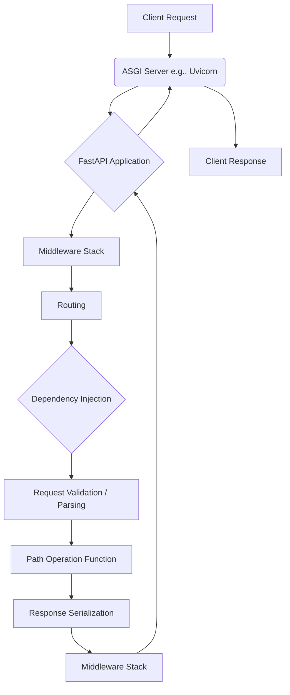

# Architecture Documentation

_Generated: 2026-03-19T07:56:05+00:00_

# Codebase Gist

## What Is This?
FastAPI is a modern, fast (high-performance) web framework for building APIs with Python 3.8+ based on standard Python type hints. It's designed for developers who need to build robust and efficient web services quickly, leveraging automatic interactive API documentation (Swagger UI/ReDoc) and data validation provided by Pydantic. It serves a wide range of users from individual developers to large organizations building microservices and web applications. The architecture style is primarily a web API framework, facilitating the creation of RESTful APIs.

## Tech Stack
- **Languages**: Python 3.8+
- **Frameworks**: FastAPI (built on Starlette for web parts and Pydantic for data parts)
- **Libraries**:
    - `starlette` (for HTTP and WebSocket functionality)
    - `pydantic` (for data validation and serialization)
    - `anyio` (for asynchronous operations)
    - `annotated_doc` (for documentation generation)
- **Package Managers**: `pip` (implied for Python packages)

## Architecture Overview
FastAPI is built as a layered framework, extending Starlette for its core ASGI (Asynchronous Server Gateway Interface) capabilities and integrating Pydantic for data handling. The core architecture revolves around routing HTTP requests to Python functions (path operations), handling request validation and serialization, managing dependencies, and applying middleware.



## Key Components
- **FastAPI Application (`FastAPI`)** — The main application class that orchestrates routing, middleware, and dependency injection.
    - Key files: `fastapi/applications.py`, `fastapi/__init__.py`
- **Routing (`APIRouter`)** — Handles mapping incoming HTTP requests to specific path operation functions.
    - Key files: `fastapi/routing.py`, `fastapi/__init__.py`
- **Dependency Injection (`Depends`)** — Manages and injects dependencies into path operation functions, enabling reusable logic and easier testing.
    - Key files: `fastapi/param_functions.py`, `fastapi/dependencies/utils.py`, `fastapi/dependencies/models.py`
- **Middleware** — Functions that run before and/or after each request, handling concerns like CORS, GZip compression, and error handling.
    - Key files: `fastapi/middleware/__init__.py`, `fastapi/middleware/cors.py`, `fastapi/middleware/gzip.py`, `fastapi/middleware/httpsredirect.py`, `fastapi/middleware/trustedhost.py`, `fastapi/middleware/wsgi.py`, `fastapi/middleware/asyncexitstack.py`
- **Request/Response Handling** — Manages parsing incoming request data and serializing outgoing response data, often leveraging Pydantic models.
    - Key files: `fastapi/requests.py`, `fastapi/responses.py`, `fastapi/encoders.py`, `fastapi/param_functions.py`
- **Security** — Provides utilities for implementing various authentication and authorization schemes.
    - Key files: `fastapi/security/__init__.py`, `fastapi/security/api_key.py`, `fastapi/security/http.py`, `fastapi/security/oauth2.py`, `fastapi/security/open_id_connect_url.py`
- **OpenAPI Generation** — Automatically generates OpenAPI (Swagger) specifications and provides interactive documentation UIs.
    - Key files: `fastapi/openapi/__init__.py`, `fastapi/openapi/docs.py`, `fastapi/openapi/models.py`, `fastapi/openapi/utils.py`

## Entry Points
- **API Endpoints**: Defined using decorator methods on `FastAPI` or `APIRouter` instances (e.g., `@app.get("/items/")`, `@app.post("/login")`).
    - Example usage:
        ```python
        # fastapi/security/api_key.py
        # line 81
        @app.get("/items/")
        # fastapi/security/http.py
        # line 134
        @app.get("/users/me")
        # fastapi/security/oauth2.py
        # line 39
        @app.post("/login")
        ```
- **CLI Commands**: The `fastapi` module can be run directly, suggesting a CLI entry point.
    - Key files: `fastapi/__main__.py`, `fastapi/cli.py`

## Data & Storage
No direct database, cache, or file storage implementations were found within the core FastAPI framework files. FastAPI is designed to be database-agnostic, allowing users to integrate their preferred ORMs or database clients. The framework handles data validation and serialization using Pydantic models, which can be mapped to various data storage solutions by the user.

## External Dependencies
- **Starlette**: Provides the core ASGI application, routing, middleware, and response classes. FastAPI builds directly on Starlette.
- **Pydantic**: Used for data validation, serialization, and automatic OpenAPI schema generation.
- **AnyIO**: Provides asynchronous concurrency primitives.
- **Uvicorn**: (Implied) An ASGI server typically used to run FastAPI applications.
- **Kubernetes/Docker**: (Implied from documentation) FastAPI applications are often deployed using containerization technologies like Docker and orchestrated with Kubernetes.
    - Evidenced by documentation files like `docs/en/docs/deployment/docker.md` and `docs/en/docs/deployment/concepts.md`.

## How Things Connect
FastAPI applications process requests through a sequence of steps:
1.  **ASGI Server**: An ASGI server (like Uvicorn) receives an incoming HTTP request and passes it to the FastAPI application.
2.  **Middleware**: The request first passes through the configured middleware stack (e.g., `AsyncExitStackMiddleware`, `CORSMiddleware`, `GZipMiddleware`). Middleware can modify requests, responses, or perform actions before/after the main route handler.
    - `fastapi/middleware/asyncexitstack.py`
3.  **Routing**: The `APIRouter` (or `FastAPI` instance) matches the incoming request's URL path and HTTP method to a registered "path operation function".
    - `fastapi/routing.py`
4.  **Dependency Resolution**: Before executing the path operation function, FastAPI resolves its dependencies. This involves inspecting function parameters, identifying `Depends()` calls, and executing the dependency functions. Dependencies can be synchronous or asynchronous, and can themselves have sub-dependencies.
    - `fastapi/dependencies/utils.py`
    - `fastapi/param_functions.py`
5.  **Request Validation**: Parameters (path, query, header, cookie) and request body data are automatically validated against their type hints (Pydantic models for bodies). If validation fails, a `RequestValidationError` is raised.
    - `fastapi/routing.py` (specifically `get_request_handler` function)
    - `fastapi/exceptions.py`
6.  **Path Operation Execution**: The validated data and resolved dependencies are passed as arguments to the path operation function, which then executes its logic.
7.  **Response Serialization**: The return value of the path operation function is automatically serialized into the appropriate response format (e.g., JSON) based on the declared `response_model` or default behavior.
    - `fastapi/routing.py` (specifically `serialize_response` function)
    - `fastapi/encoders.py`
8.  **Response Handling**: The serialized data is wrapped in a `Response` object and sent back through the middleware stack to the ASGI server, which then sends it to the client.

The `request_response` function in `fastapi/routing.py` illustrates the core request handling flow, including the use of `AsyncExitStack` for managing dependencies with `yield`.
```python
# fastapi/routing.py
# lines 110-136
    async def app(scope: Scope, receive: Receive, send: Send) -> None:
        request = Request(scope, receive, send)

        async def app(scope: Scope, receive: Receive, send: Send) -> None:
            # Starts customization
            response_awaited = False
            async with AsyncExitStack() as request_stack:
                scope["fastapi_inner_astack"] = request_stack
                async with AsyncExitStack() as function_stack:
                    scope["fastapi_function_astack"] = function_stack
                    response = await f(request)
                await response(scope, receive, send)
                # Continues customization
                response_awaited = True
            if not response_awaited:
                raise FastAPIError(
                    "Response not awaited. There's a high chance that the "
                    "application code is raising an exception and a dependency with yield "
                    "has a block with a bare except, or a block with except Exception, "
                    "and is not raising the exception again. Read more about it in the "
                    "docs: https://fastapi.tiangolo.com/tutorial/dependencies/dependencies-with-yield/#dependencies-with-yield-and-except"
                )

        # Same as in Starlette
        await wrap_app_handling_exceptions(app, request)(scope, receive, send)
```

## Developer Quick Start
To get started with FastAPI, you typically need to:
1.  **Install**: Install FastAPI and an ASGI server like Uvicorn.
    ```bash
    pip install fastapi "uvicorn[standard]"
    ```
2.  **Create an application**: Write your API code in a Python file (e.g., `main.py`).
    ```python
    # main.py
    from fastapi import FastAPI

    app = FastAPI()

    @app.get("/")
    async def read_root():
        return {"Hello": "World"}
    ```
3.  **Run**: Start the Uvicorn server.
    ```bash
    uvicorn main:app --reload
    ```
    This will start the server, typically accessible at `http://127.0.0.1:8000`. The interactive API documentation will be available at `http://127.0.0.1:8000/docs`.

## Gaps & Uncertainties
- Specific versions of all third-party libraries (e.g., Starlette, Pydantic) are not explicitly listed in the `__init__.py` or `fastapi/applications.py` files, though `__version__ = "0.135.1"` is present for FastAPI itself.
- Detailed build tools and package managers beyond `pip` are not explicitly defined in the provided files.
- The exact cloud/infra setup is not detectable from the core framework files, though documentation implies Docker and Kubernetes usage.