# Architecture Documentation

_Generated: 2026-03-19T09:02:22+00:00_

# Impact Analysis: `fastapi/routing.py` (route, add_api_route, api_route, get/put/post/delete/patch methods)

---

## 1. Change Summary

This analysis covers changes to the following methods in `fastapi/routing.py`:
- `route`
- `add_api_route`
- `api_route`
- HTTP verb methods: `get`, `put`, `post`, `delete`, `patch`

**Summary of Change:**  
These methods are the core mechanisms by which FastAPI's routers and applications register path operations (endpoints) for HTTP methods. They are used both directly and indirectly throughout the FastAPI codebase and by downstream consumers (users, libraries, and documentation). Any change to their signatures, behavior, or side effects will impact:
- How endpoints are registered and exposed
- How decorators like `@app.get`, `@router.post`, etc., function
- The extensibility and customizability of routers and routes
- The ability for users to subclass or override routing behavior

**Why it matters:**  
These methods are foundational to FastAPI's routing system. They are called by both internal framework code and user code (via decorators and router inclusion). Changes here can break endpoint registration, alter OpenAPI schema generation, or disrupt custom route/handler logic, affecting both the framework and all user applications.

---

## 2. Directly Affected Files

| File                                                      | How it uses the target                                           | What breaks                                    | Severity |
|-----------------------------------------------------------|------------------------------------------------------------------|------------------------------------------------|----------|
| `fastapi/applications.py`                                 | Calls `router.add_api_route`, `router.api_route`, HTTP verbs     | App/Router endpoint registration, decorators    | HIGH     |
| `fastapi/__init__.py`                                    | Exposes `APIRouter` (from routing)                              | Import path for users                          | MEDIUM   |
| `fastapi/openapi/utils.py`                               | Uses `APIRoute` for OpenAPI schema generation                   | OpenAPI docs generation                        | HIGH     |
| `fastapi/utils.py`                                       | Imports `APIRoute`                                              | Utilities relying on route structure           | LOW      |
| `docs_src/custom_request_and_route/tutorial001_an_py310.py` | Imports `APIRoute` for custom route examples                    | Example code, docs                             | LOW      |
| `docs_src/custom_request_and_route/tutorial001_py310.py`  | Imports `APIRoute` for custom route examples                    | Example code, docs                             | LOW      |
| `docs_src/custom_request_and_route/tutorial002_an_py310.py` | Imports `APIRoute` for custom route examples                    | Example code, docs                             | LOW      |
| `docs_src/custom_request_and_route/tutorial002_py310.py`  | Imports `APIRoute` for custom route examples                    | Example code, docs                             | LOW      |
| `docs_src/custom_request_and_route/tutorial003_py310.py`  | Imports `APIRoute` for custom route examples                    | Example code, docs                             | LOW      |
| `docs_src/generate_clients/tutorial003_py310.py`          | Imports `APIRoute`                                              | Example code, docs                             | LOW      |
| `docs_src/path_operation_advanced_configuration/tutorial002_py310.py` | Imports `APIRoute`                                              | Example code, docs                             | LOW      |
| `tests/test_custom_route_class.py`                       | Imports and uses `APIRoute`                                     | Custom route class tests                       | MEDIUM   |
| `tests/test_generate_unique_id_function.py`              | Imports `APIRoute`                                              | Unique ID generation tests                     | LOW      |
| `tests/test_route_scope.py`                              | Imports `APIRoute`, `APIWebSocketRoute`                         | Route scope tests                              | LOW      |
| `tests/test_sse.py`                                      | Imports `fastapi.routing`                                       | SSE route tests                                | LOW      |

---

## 3. Transitive Impact

These files/modules are affected because they import or depend on the above methods/classes, or use the decorators that rely on them:

| File/Module                                         | Dependency Chain                                                      | Impacted Area                        | Severity |
|-----------------------------------------------------|-----------------------------------------------------------------------|--------------------------------------|----------|
| All user code using `@app.get`, `@app.post`, etc.   | Decorators call `api_route`/`add_api_route` on routers/applications   | Endpoint registration                | CRITICAL |
| All user code using `APIRouter`                     | `APIRouter` methods delegate to `fastapi/routing.py` methods                  | Custom routers, modular apps         | HIGH     |
| All user code subclassing `APIRoute`                | Subclassing relies on method signatures/behavior                      | Custom route logic                   | HIGH     |
| All documentation and tutorials                     | Examples use these methods/decorators                                 | Docs accuracy, user onboarding       | MEDIUM   |
| OpenAPI schema generation (`fastapi/openapi/utils.py`) | Uses `APIRoute` for schema extraction                                | API documentation                    | HIGH     |
| Test suite (`tests/`, `docs_src/`)                  | Tests use decorators, routers, custom routes                          | Test coverage, regression detection  | HIGH     |

**Mermaid Dependency Diagram:**

```mermaid
graph TD
    fastapi/routing.py
    fastapi/routing.py --> fastapi/applications.py
    fastapi/routing.py --> fastapi/openapi/utils.py
    fastapi/routing.py --> fastapi/__init__.py
    fastapi/routing.py --> fastapi/utils.py
    fastapi/routing.py --> docs_src/custom_request_and_route/tutorial001_an_py310.py
    fastapi/routing.py --> docs_src/custom_request_and_route/tutorial001_py310.py
    fastapi/routing.py --> docs_src/custom_request_and_route/tutorial002_an_py310.py
    fastapi/routing.py --> docs_src/custom_request_and_route/tutorial002_py310.py
    fastapi/routing.py --> docs_src/custom_request_and_route/tutorial003_py310.py
    fastapi/routing.py --> docs_src/generate_clients/tutorial003_py310.py
    fastapi/routing.py --> docs_src/path_operation_advanced_configuration/tutorial002_py310.py
    fastapi/routing.py --> tests/test_custom_route_class.py
    fastapi/routing.py --> tests/test_generate_unique_id_function.py
    fastapi/routing.py --> tests/test_route_scope.py
    fastapi/routing.py --> tests/test_sse.py
    fastapi/applications.py --> AllUserCode
    fastapi/routing.py --> AllUserCode
    fastapi/routing.py --> fastapi/openapi/utils.py
    fastapi/openapi/utils.py --> OpenAPI
    AllUserCode --> Endpoints
    AllUserCode --> APIRouter
    AllUserCode --> APIRouteSubclass
```

---

## 4. Cross-Service Impact

- **APIs/Events/Shared Schemas:**  
  No direct cross-service boundaries are affected within this monorepo, as FastAPI is a framework. However, any downstream service or application using FastAPI as a dependency will be affected if these methods change in a non-backward-compatible way.
- **OpenAPI/Docs:**  
  Changes may affect the OpenAPI schema output, which is consumed by external tools, code generators, and client SDKs.

---

## 5. Interface Contract Changes

- **API Endpoints:**  
  Any change to how endpoints are registered (e.g., parameter changes, decorator behavior) will alter the public API surface of FastAPI applications.
- **OpenAPI Schema:**  
  Changes in route registration or metadata can affect the generated OpenAPI schema, which is a contract for clients and code generators.
- **Subclassing/Extension Points:**  
  If method signatures or expected behaviors change, custom subclasses of `APIRoute` or `APIRouter` may break.

---

## 6. Backward Compatibility

- **Will existing clients break without changes?**  
  Yes, if method signatures, decorator behaviors, or registration logic change incompatibly, user code and third-party libraries will break.
- **Can the change be made backward-compatible?**  
  Only if all public method signatures and behaviors are preserved, or if changes are opt-in via feature flags or versioning.
- **Versioning or feature flag options:**  
  - Introduce new parameters as optional with defaults.
  - Use deprecation warnings for old behaviors.
  - Consider major version bump if breaking changes are unavoidable.

---

## 7. Test Impact

**Test files that need updating or careful review:**

| Test Area                  | Files to Test                                                                                                 | Priority |
|----------------------------|--------------------------------------------------------------------------------------------------------------|----------|
| Core Routing               | `tests/test_custom_route_class.py`, `tests/test_route_scope.py`, `tests/test_generate_unique_id_function.py`  | HIGH     |
| HTTP Method Decorators     | All tests using `@app.get`, `@app.post`, etc. (e.g., `tests/test_request_params/`, `tests/test_tutorial/`)    | CRITICAL |
| OpenAPI Generation         | `tests/test_openapi_*`, `tests/test_schema_*`, `tests/test_generate_unique_id_function.py`                   | HIGH     |
| SSE/WebSockets             | `tests/test_sse.py`, `tests/test_ws_router.py`, `tests/test_ws_dependencies.py`                              | MEDIUM   |
| Example/Docs Validation    | `docs_src/custom_request_and_route/`, `docs_src/path_operation_advanced_configuration/`, etc.                | MEDIUM   |

---

## 8. Risk Assessment

- **Risk Level:** CRITICAL
- **Blast Radius:**  
  - All FastAPI applications and libraries using routing, decorators, or custom routes.
  - All documentation and tutorials.
  - All OpenAPI schema consumers.
- **Key Risks:**  
  - Breaking endpoint registration (apps may not start or expose endpoints)
  - Decorators (`@app.get`, etc.) may not work as expected
  - Custom `APIRoute` subclasses may fail
  - OpenAPI schema may be incorrect or incomplete
  - Downstream code generators and client SDKs may break
- **What's safe:**  
  - Pure documentation or example code (unless used as test cases)
  - Files not importing or subclassing routing methods/classes

---

## 9. Migration & Rollback

**Migration Steps:**
1. Review all usages of `add_api_route`, `api_route`, and HTTP verb methods in both FastAPI core and user code.
2. Update any custom subclasses of `APIRoute` or `APIRouter` to match new signatures/behaviors.
3. Update documentation and tutorials to reflect any changes in usage or behavior.
4. Run the full test suite, including all example and tutorial code.
5. Validate OpenAPI schema output for correctness.
6. Communicate changes to downstream consumers (release notes, migration guides).

**Database Migration Steps:**  
N/A (no DB schema changes).

**Rollback Procedure:**
1. Revert changes to `fastapi/routing.py` and any dependent files.
2. Re-run the test suite to ensure restoration of previous behavior.
3. Notify users of rollback if released.

**CI/CD Considerations:**
- Require all tests (including documentation examples) to pass before merge.
- Consider canary releases or feature flags for major changes.
- Monitor for downstream breakage via issue tracker and user reports.

---

## 10. Gaps & Uncertainties

- Dynamic imports or runtime patching of routing methods are not traceable statically.
- User code outside this repository (third-party libraries, private apps) may subclass or monkeypatch these methods in undocumented ways.
- Some documentation files reference `APIRoute`/`APIRouter` in prose but do not import or use them directly; these are not listed above.
- Config-driven or plugin-based route registration (e.g., via dependency injection frameworks) may be affected but are not statically detectable.
- The full set of test files using HTTP method decorators is large; only representative files are listed above.

---