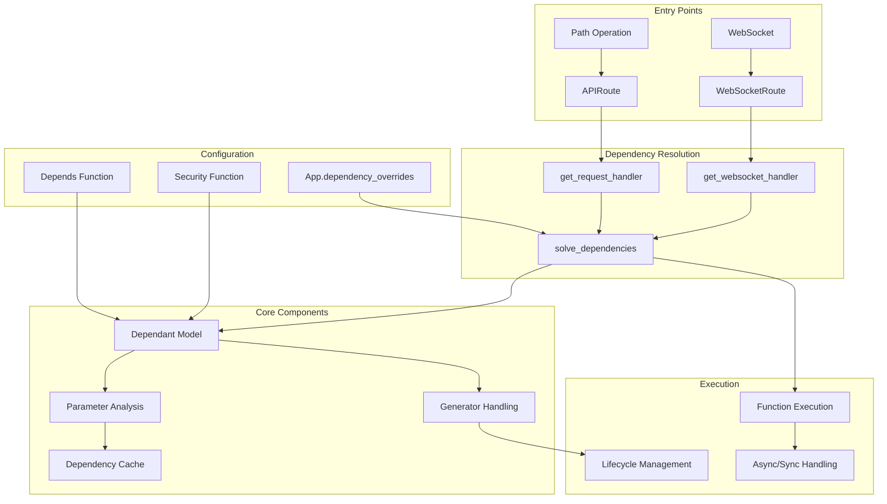
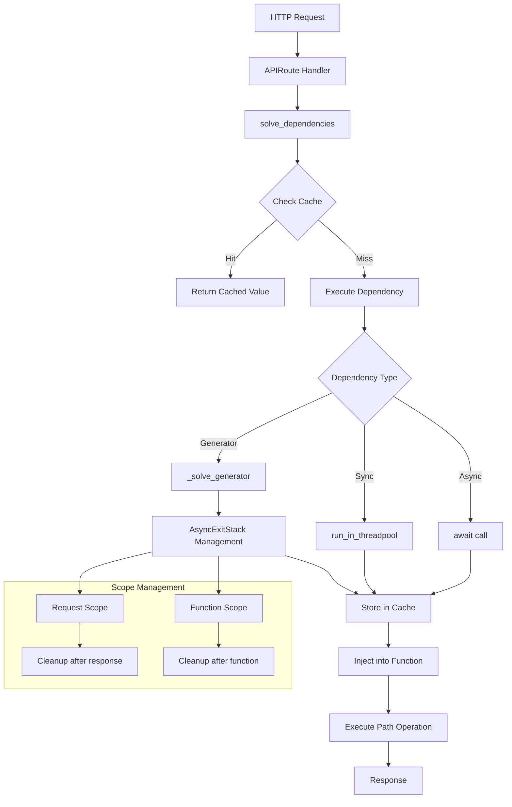

# Architecture Documentation

_Generated: 2026-03-19T08:19:31+00:00_

# FastAPI Dependency System Architecture

## Overview

FastAPI's dependency system provides a powerful dependency injection mechanism that allows for automatic resolution, caching, and lifecycle management of dependencies across HTTP requests and WebSocket connections. The system uses function signatures and type annotations to automatically inject dependencies into path operation functions, with support for nested dependencies, caching, and cleanup operations.

## Architecture Overview



## Component Breakdown

| Component | File | Responsibility |
|-----------|------|----------------|
| `Depends` Function | `fastapi/param_functions.py` | Creates dependency declarations with caching and scope options |
| `Depends` Dataclass | `fastapi/params.py` | Stores dependency configuration (callable, cache, scope) |
| `Dependant` Model | `fastapi/dependencies/models.py` | Represents a dependency with all its metadata and sub-dependencies |
| `solve_dependencies` | `fastapi/dependencies/utils.py` | Core dependency resolution engine |
| `get_dependant` | `fastapi/dependencies/utils.py` | Analyzes functions to create Dependant objects |
| `analyze_param` | `fastapi/dependencies/utils.py` | Inspects function parameters for dependency information |
| `get_request_handler` | `fastapi/routing.py` | Creates request handlers that integrate dependency resolution |
| `APIRoute` | `fastapi/routing.py` | Route class that manages dependencies for HTTP endpoints |
| `FastAPI.dependency_overrides` | `fastapi/applications.py` | Global dependency override mechanism for testing |

## Execution Flow

1. **Route Registration** (`fastapi/routing.py:949-951`)
   - `APIRoute.__init__` calls `get_dependant()` to analyze the endpoint function
   - Creates a `Dependant` object representing the function's dependency tree

2. **Parameter Analysis** (`fastapi/dependencies/utils.py:311`)
   - `analyze_param()` inspects each function parameter
   - Identifies `Depends()` declarations and extracts dependency information

3. **Dependency Tree Building** (`fastapi/dependencies/utils.py:286`)
   - `get_dependant()` recursively analyzes sub-dependencies
   - Builds a tree structure of `Dependant` objects

4. **Request Handling** (`fastapi/routing.py:457`)
   - Request handler calls `solve_dependencies()` with the dependency tree
   - Passes request context and dependency cache

5. **Dependency Resolution** (`fastapi/dependencies/utils.py:598`)
   - `solve_dependencies()` traverses the dependency tree depth-first
   - Checks cache for previously resolved dependencies

6. **Override Checking** (`fastapi/dependencies/utils.py:633-639`)
   - Checks `dependency_overrides_provider.dependency_overrides` for test overrides
   - Replaces original dependency with override if found

7. **Execution Strategy** (`fastapi/dependencies/utils.py:667-680`)
   - Generator dependencies: Uses `_solve_generator()` with AsyncExitStack
   - Async functions: Direct `await` call
   - Sync functions: `run_in_threadpool()` execution

8. **Caching** (`fastapi/dependencies/utils.py:664-684`)
   - Stores resolved values in `dependency_cache` using `cache_key`
   - Respects `use_cache` setting from `Depends()` declaration

## Data Flow Diagram



## Key Interfaces and Contracts

### Depends Function Interface
```python
# fastapi/param_functions.py:2283-2339
def Depends(
    dependency: Callable[..., Any] | None = None,
    *,
    use_cache: bool = True,
    scope: Literal["function", "request"] | None = None,
) -> Any
```

### Dependant Model Structure
```python
# fastapi/dependencies/models.py:31-51
@dataclass
class Dependant:
    path_params: list[ModelField]
    query_params: list[ModelField] 
    header_params: list[ModelField]
    cookie_params: list[ModelField]
    body_params: list[ModelField]
    dependencies: list["Dependant"]
    use_cache: bool = True
    scope: Literal["function", "request"] | None = None
```

### Dependency Resolution Interface
```python
# fastapi/dependencies/utils.py:598-611
async def solve_dependencies(
    *,
    request: Request | WebSocket,
    dependant: Dependant,
    dependency_cache: dict[DependencyCacheKey, Any] | None = None,
    dependency_overrides_provider: Any | None = None,
) -> SolvedDependency
```

### Cache Key Generation
```python
# fastapi/dependencies/models.py:63-71
@cached_property
def cache_key(self) -> DependencyCacheKey:
    return (
        self.call,
        tuple(sorted(set(self.oauth_scopes or []))),
        self.computed_scope or "",
    )
```

## Design Patterns Identified

### 1. Dependency Injection Pattern
- **Implementation**: `solve_dependencies()` function automatically resolves and injects dependencies
- **Location**: `fastapi/dependencies/utils.py:598`
- **Benefits**: Loose coupling, testability, automatic lifecycle management

### 2. Factory Pattern
- **Implementation**: `get_dependant()` creates `Dependant` objects based on function analysis
- **Location**: `fastapi/dependencies/utils.py:286`
- **Benefits**: Centralized object creation, consistent dependency tree building

### 3. Cache Pattern
- **Implementation**: Dependency results cached by `cache_key` to avoid re-computation
- **Location**: `fastapi/dependencies/utils.py:664-684`
- **Benefits**: Performance optimization, consistent state within request

### 4. Strategy Pattern
- **Implementation**: Different execution strategies for sync/async/generator dependencies
- **Location**: `fastapi/dependencies/utils.py:667-680`
- **Benefits**: Flexible execution based on dependency type

### 5. Context Manager Pattern
- **Implementation**: `AsyncExitStack` for generator dependency lifecycle management
- **Location**: `fastapi/dependencies/utils.py:578`
- **Benefits**: Automatic cleanup, proper resource management

### 6. Override Pattern
- **Implementation**: `dependency_overrides` dictionary for testing
- **Location**: `fastapi/applications.py:965`
- **Benefits**: Easy testing, runtime dependency replacement

### 7. Composite Pattern
- **Implementation**: Nested dependency trees with recursive resolution
- **Location**: `fastapi/dependencies/models.py:38`
- **Benefits**: Complex dependency hierarchies, modular design